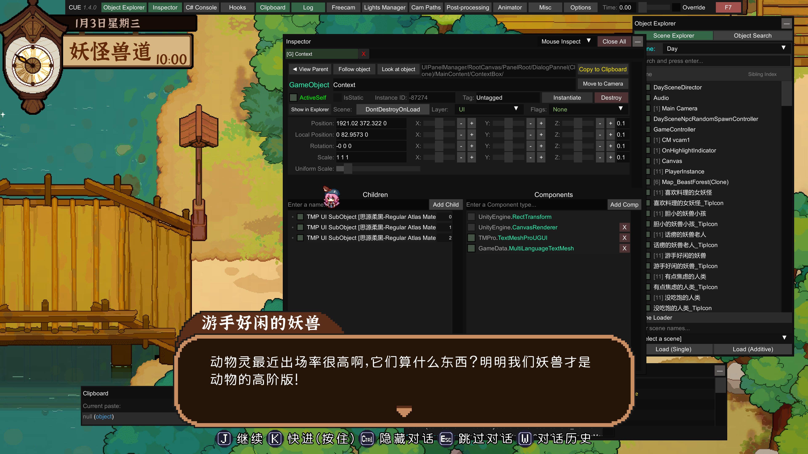
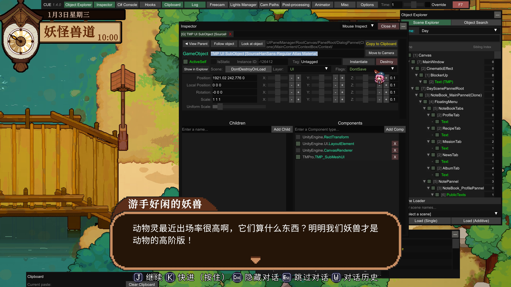
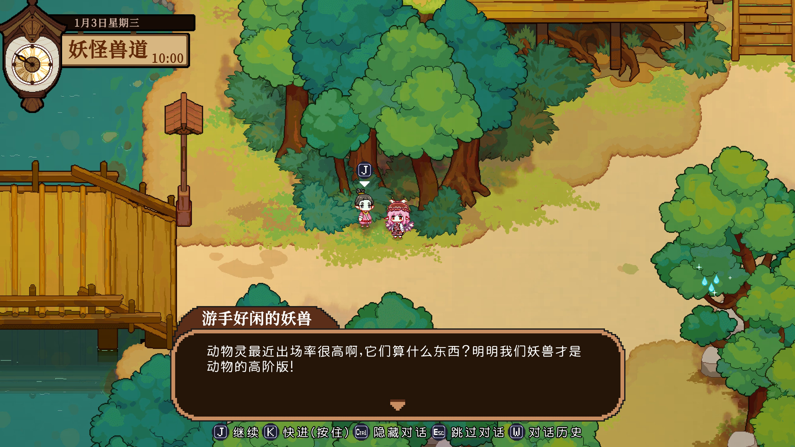

> [!CAUTION]
>
> 目前仅适用于 v4.4.0 版本
>
> 以后有空写一个 plugin 版本动态替换字体

# 使用说明

解压，复制粘贴到游戏根目录，替换对应的 `system_fontdata_assets_all.bundle` 文件

# 已知问题

行距相比 v4.3.0 变窄了。

江西拙楷字体删了，导致新版本字体比旧版少了一个，这就很难办了。

补回去这个字体的话，不光要重建字库，而且要重建所有用到这个字体的 UI 元素的映射关系（现在被强制映射到了 JYHPHZ 字体上）
如果把 JYHPHZ 字体映射成江西拙楷，则会导致原本用这个字体的 UI 元素出问题。

而且就算想还原，我也不知道这密密麻麻 17 个文件怎么塞进 6 个文件里面。。

可能的一个途径是通过 Hook 强行加载 AssetBundle，之后 Hook TMPro 初始化。

目前强制塞进去，大概能做到这个效果，不过丢失了 outline：

具体会丢失这些效果：

分层描边特效（CutinLayer0/1/2）

文件：

江西拙楷2.0 CutinLayer0-CAB-53407a77752448d262c9a0f4bbf30ebc--6700517811373610890.json

江西拙楷2.0 CutinLayer1-CAB-53407a77752448d262c9a0f4bbf30ebc-5810740715559020870.json

江西拙楷2.0 CutinLayer2-CAB-53407a77752448d262c9a0f4bbf30ebc-2457333242222550878.json

你会失去按层级变化的描边宽度和颜色（OutlineWidth 从 0.1 到 0.3）。

特定 UI 样式材质

文件：

江西拙楷2.0 ItemName_Layer0-CAB-53407a77752448d262c9a0f4bbf30ebc-4607899826668819242.json

江西拙楷2.0 ItemName_Layer1-CAB-53407a77752448d262c9a0f4bbf30ebc-7279740990451218989.json

江西拙楷2.0 Inlined_Red-CAB-53407a77752448d262c9a0f4bbf30ebc--7742702977179710743.json

你会失去这些场景下专用的描边颜色和细节调参（例如金边、红内描等）。

黑描边/粉描边变体

文件：

江西拙楷2.0 Outlined_Black-CAB-53407a77752448d262c9a0f4bbf30ebc-7747101284640256625.json

江西拙楷2.0 Outlined_Black_Thick-CAB-53407a77752448d262c9a0f4bbf30ebc--8293266096448224359.json

江西拙楷2.0 Outlined_Pink-CAB-53407a77752448d262c9a0f4bbf30ebc--3874285640931662446.json

会退化成目标里已有的单一材质风格，不会有这些颜色/粗细变体。

阴影效果

文件：

江西拙楷2.0 Shadow-CAB-53407a77752448d262c9a0f4bbf30ebc--4238985395529182361.json

这是 UNDERLAY_ON 材质，关键是 y=-0.5 的下阴影偏移。这个会丢失。

# TODO

- [ ] 写一个 bepinex 插件动态 hook 替换字体

  

# 对比图

**v4.3.0**

**v4.4.0（原版）**

**v4.4.0（替换字体）**

**v4.4.0（替换字体+强行替换）**

# 

# 免责及版权声明

1. **游戏资源版权**：本软件/项目中所包含的任何游戏资源（包括但不限于图片、音频、模型、代码提取物等），其全部知识产权及版权均属于原游戏开发商所有。
2. **字体文件版权**：本软件/项目内所嵌入或使用的字体文件，其版权及最终解释权归原字体设计者或相关字体字库版权方所有。
3. **侵权及处理**：本项目为非盈利性质，仅供爱好者学习、参考与交流，严禁用于任何商业用途。若本项目的相关内容无意中侵犯了您的合法权益，请提供相关权利证明并通过邮箱联系我们，我们将在核实情况后立即采取删除、下架等妥善处理措施。
